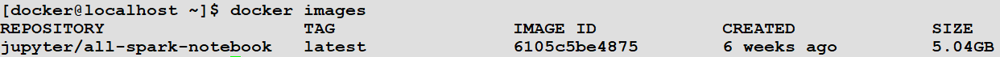
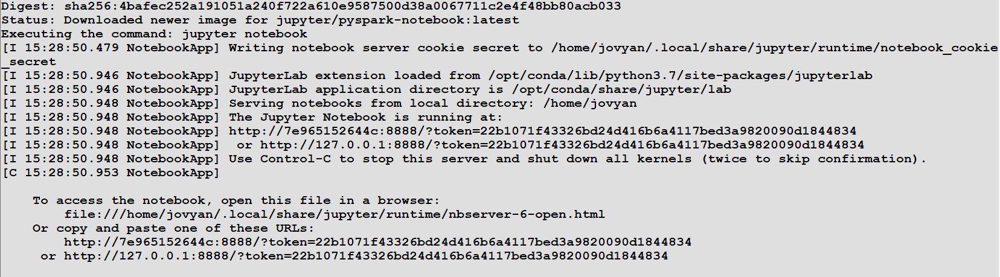
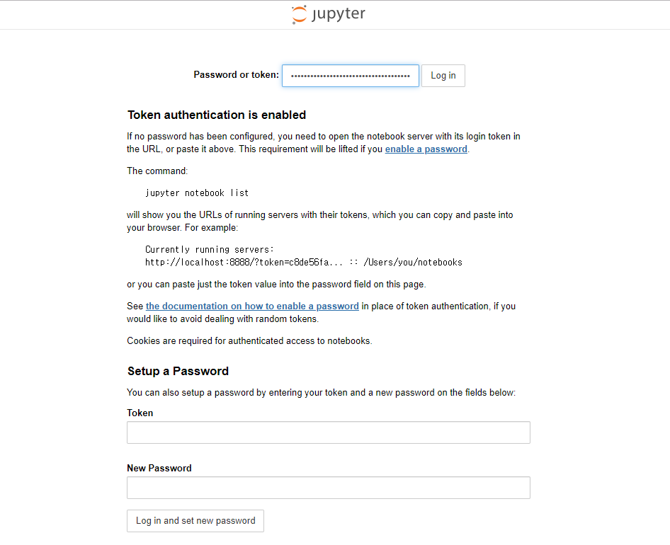
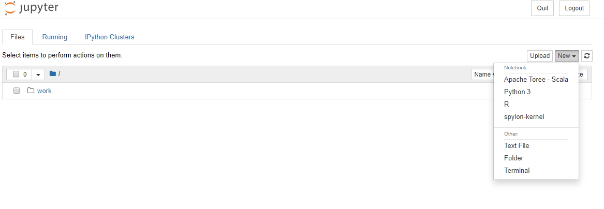

1. docker hub에서 이미지 가져오기
<pre><code>
sudo docker pull jupyter/all-spark-notebook  
</code></pre>

2. 도커 이미지 확인
<pre><code>
sudo docker images
</code></pre>

3. 컨테이너 실행.
<pre><code>
docker run -p 8888:8888 -p 4040:4040 -v /home/docker/spark --name spark jupyter/all-spark-notebook
</code></pre>

8888포트로 jupyter 접속 후 토큰으로 로그인.

4. 확인

scala와 python 모두 사용가능하기 때문에 2가지 언어로 spark 연습을 할수 있겠다.
